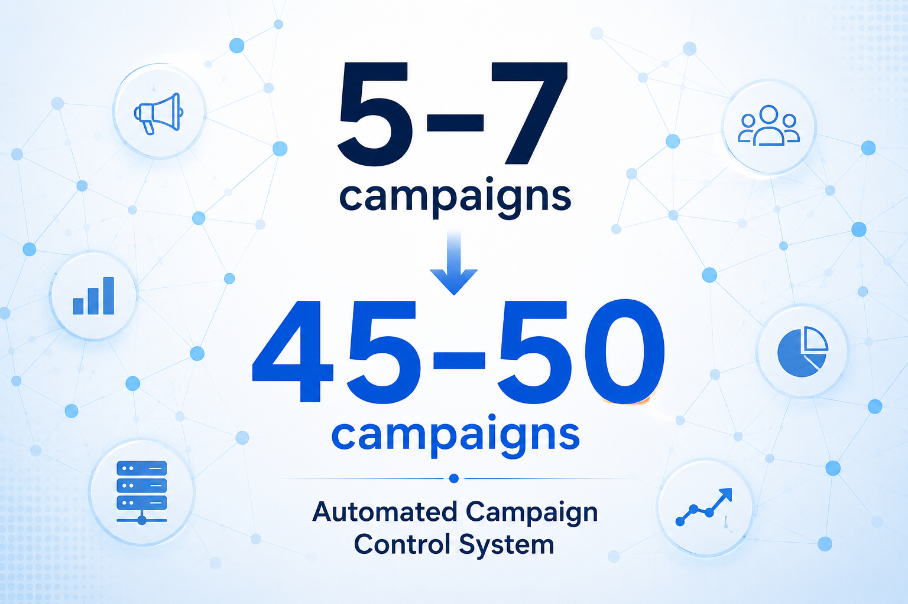
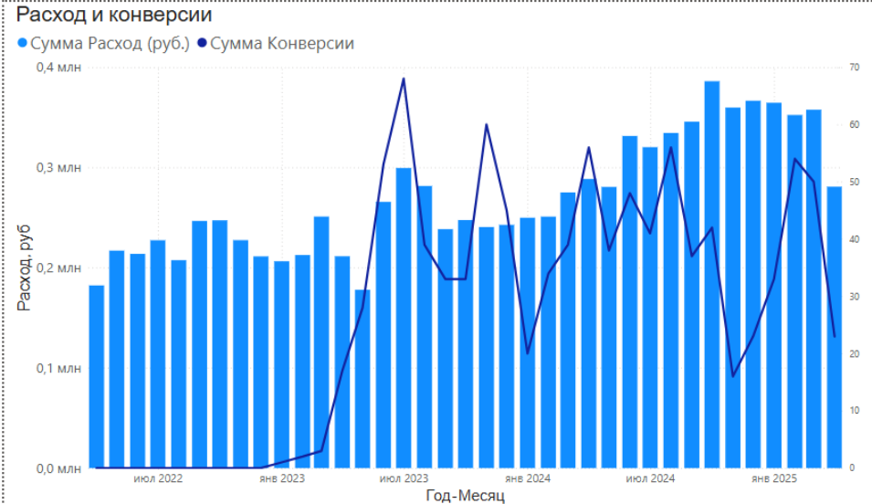
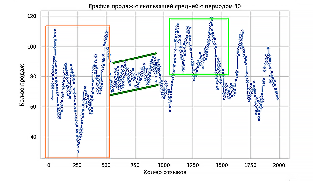
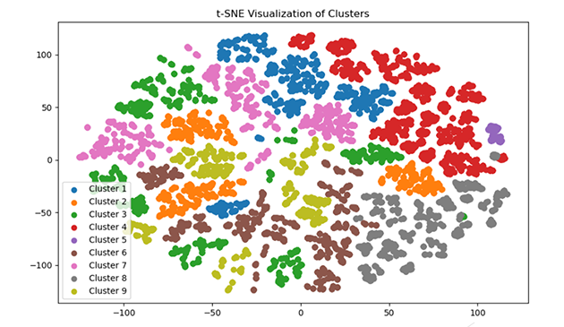
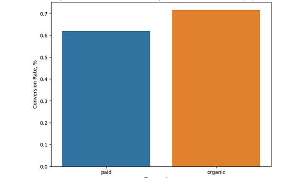
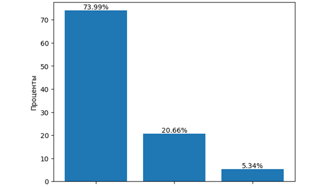
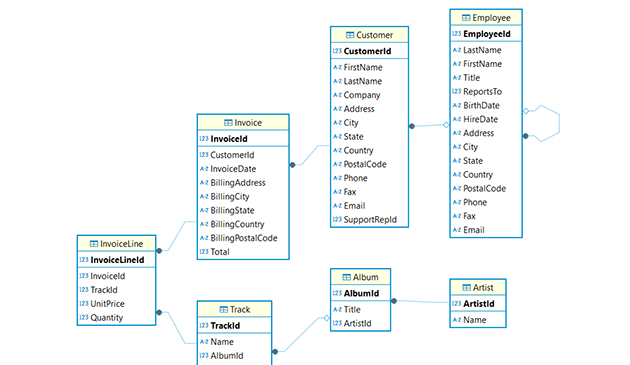

  <h2>Hi, I'm Aleksandr Mateiko.</h2>

  

    I design and build data workflows that transform fragmented business data
    into reliable analytical systems.
  

  

    My expertise includes ETL development, API integrations, business intelligence,
    reporting automation and data pipeline engineering.
  

  

    Python
    SQL
    ETL
    REST API
    FastAPI
    ClickHouse
    DataLens
    Automation
  

  

    <a href="https://www.linkedin.com/in/aleksandr-mateiko-54b220293/" target="_blank">
      LinkedIn
    </a>

  <a href="https://github.com/matejkoas" target="_blank">
    GitHub
  </a>

  <a href="/assets/files/resume.pdf" target="_blank">
    Resume
  </a>
  

<section class="projects-section">
  <h2>Featured Projects</h2>
    
 Selected projects demonstrating my experience in analytics engineering, ETL development, API integrations and business intelligence systems. 
    

  <!--Eliminating Operational Bottlenecks Through Automated Campaign Control -->

<a href="/cases/case12-eliminating-operational-bottlenecks">
  
  

  <h3>Eliminating Operational Bottlenecks Through Automated Campaign Control </h3>
  
<strong>Technologies:</strong> Power BI, DAX, М, Python

  
Нахождение точек роста в рекламе Яндекс.Директ по продаже межкомнатных дверей на основе анализа данных за длительный период работы.

</a>

</section>

<!-- Начало секции с предыдущими проектами -->
<section class="projects-section">

  <h2>Previous Analytics Projects</h2>

  

      Earlier analytical projects focused on statistical analysis,
      experimentation and business-oriented insights.
  

  

<!-- Кейс по Power BI -->
  

  <a href="/cases/bi_case">
    
    

    <h3>Аналитика Power BI. Анализ эффективности рекламы Яндекс.Директ </h3>
    
<strong>Стек:</strong> Power BI, DAX, М, Python

    
Нахождение точек роста в рекламе Яндекс.Директ по продаже межкомнатных дверей на основе анализа данных за длительный период работы.

  </a>
  

<!-- Кейс по SQL -->
  

    <a href="/cases/case6_sql">
      
      

      <h3>E-commerce SQL Исследование: Поведение клиентов и анализ продаж</h3>
    
<strong>Стек:</strong> SQL, SQLite, DBeaver

    
Исследование поведения клиентов. Построение воронки продаж.

    </a>
  

<!-- Кейс по Wildberries -->
  

    <a href="/cases/python_reviews">
      
      

      <h3>Влияние количества отзывов на рост продаж в маркетплейсе Wildberries</h3>
    
<strong>Стек:</strong> python, matplotlib, seaborn, Google Colab

    
Исследование по выявлению стратегии конкурентов в наборе отзывов при развитии товаров.

    </a>
  

<!-- Кейс по sports goods -->
  

    <a href="/cases/sports-goods">
      
      

      <h3>Анализ продаж на python c кластеризацией и моделированием</h3>
    
<strong>Стек:</strong> Python, Jupyter Notebook, Pandas, sklearn, scipy

    
Кластеризация данных с моделированием вероятности покупки. Очистка данных. Восстановление данных

    </a>
  

<!-- Кейс по сбер авто -->
  

  <a href="/cases/sberauto">
    
    

    <h3>Очистка и анализ данных веб-сайта. Подготовка данных к моделированию</h3>
    
<strong>Стек:</strong> Python, Jupyter Notebook, Pandas, seaborn, matplotlib, scipy

    
Работа с выгруженными данными из Google Analytics. Разведывательный анализ данных, заполнение пропусков, очистка. Анализ данных: проверка гипотез, ответы на вопросы продуктовой команды.

  </a>
  

  

</section>
<!-- Конец секции с предыдущими проектами -->

<!-- Начало секции с дополнительными проектами -->
<section class="projects-section">

  <h2>Side Projects</h2>

  

      Personal projects driven by curiosity and interest in applying
      analytical thinking to unconventional questions.
  

<!-- Кейс про нумерологию -->
  

    <a href="/cases/case10-numeroligy-and-data-analytics">
      
      

      <h3>Графики не лгут. А вот даты рождения - возможно. Нумерология под прицелом Data-аналитики</h3>
    
<strong>Стек:</strong> python, matplotlib, pandas, numpy, scipy.stats

    
Тестируем нумерологию на миллионной выборке: статистика против эзотерики. Научный подход к магическим числам — без предвзятости.

    </a>
  

</section>

<!-- Старые кейсы -->
<!-- 

   

    <a href="/cases/case8_python">
      
      

      <h3>Модель спроса: влияние макрофакторов и праздников на продажи</h3>
    
<strong>Стек:</strong> Python, Pandas, NumPy, Matplotlib, Scikit-learn, TensorFlow

    
Прогнозирование продаж с учетом макроэкономических факторов и влияния праздников на спрос.

    </a>
  

   

    <a href="/cases/sql_marketing">
      
      

      <h3>SQL-кейс: Анализ эффективности маркетинговых каналов</h3>
    
<strong>Стек:</strong> SQL

    
Базовые запросы SQL по анализу эффективности источников трафика.

    </a>
  

 -->