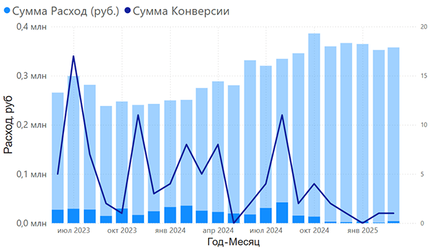

  

    <a href="/porfolio/cases/bi_case">
      
      <h3>Аналитика Power BI. Анализ эффективности рекламы Яндекс.Директ </h3>
      
<strong>Стек:</strong> Power BI, DAX, М, Python

      
Нахождение точек роста в рекламе Яндекс.Директ по продаже межкомнатных дверей на основе анализа данных за длительный период работы.

    </a>
  

  

    <a href="/porfolio/cases/sports-goods">
      
      <h3>Анализ продаж на python c кластеризацией и моделированием</h3>
    </a>
    
<strong>Стек:</strong> Python, Jupyter Notebook, Pandas, sklearn, scipy

    
Кластеризация данных с моделированием вероятности покупки. Очистка данных. Восстановление данных

  

