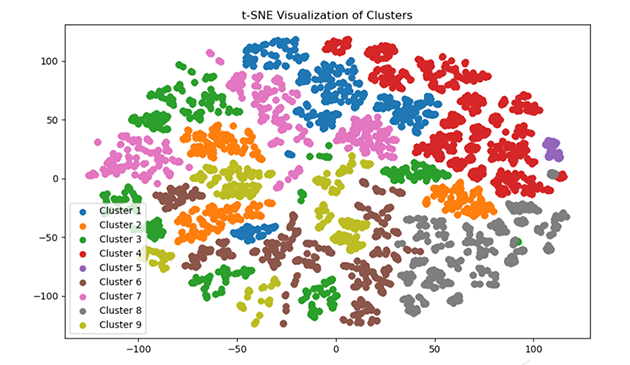

  

    <a href="/cases/bi_case">
      
      

      <h3>Аналитика Power BI. Анализ эффективности рекламы Яндекс.Директ </h3>
      
<strong>Стек:</strong> Power BI, DAX, М, Python

      
Нахождение точек роста в рекламе Яндекс.Директ по продаже межкомнатных дверей на основе анализа данных за длительный период работы.

    </a>
  

  

    <a href="/cases/case6_sql">
      
      

      <h3>E-commerce SQL Исследование: Поведение клиентов и анализ продаж</h3>
    
<strong>Стек:</strong> SQL, DBeaver

    
Исследование поведения клиентов. Построение воронки продаж.

    </a>
  

  

    <a href="/cases/sports-goods">
      
      

      <h3>Анализ продаж на python c кластеризацией и моделированием</h3>
    
<strong>Стек:</strong> Python, Jupyter Notebook, Pandas, sklearn, scipy

    
Кластеризация данных с моделированием вероятности покупки. Очистка данных. Восстановление данных

    </a>
  

  

  <a href="/cases/sberauto">
    
    

    <h3>Очистка и анализ данных веб-сайта. Подготовка данных к моделированию</h3>
    
<strong>Стек:</strong> Python, Jupyter Notebook, Pandas, seaborn, matplotlib, scipy

    
Работа с выгруженными данными из Google Analytics. Разведывательный анализ данных, заполнение пропусков, очистка. Анализ данных: проверка гипотез, ответы на вопросы продуктовой команды.

  </a>
  

   

    <a href="/cases/sql_marketing">
      
      

      <h3>SQL-кейс: Анализ эффективности маркетинговых каналов</h3>
    
<strong>Стек:</strong> SQL

    
Базовые запросы SQL по анализу эффективности источников трафика.

    </a>
  

  

    <a href="/cases/python_reviews">
      
      

      <h3>Влияние количества отзывов на рост продаж в маркетплейсе Wildberries</h3>
    
<strong>Стек:</strong> python, matplotlib, seaborn, Google Colab

    
Исследование по выявлению стратегии конкурентов в наборе отзывов при развитии товаров.

    </a>
  

